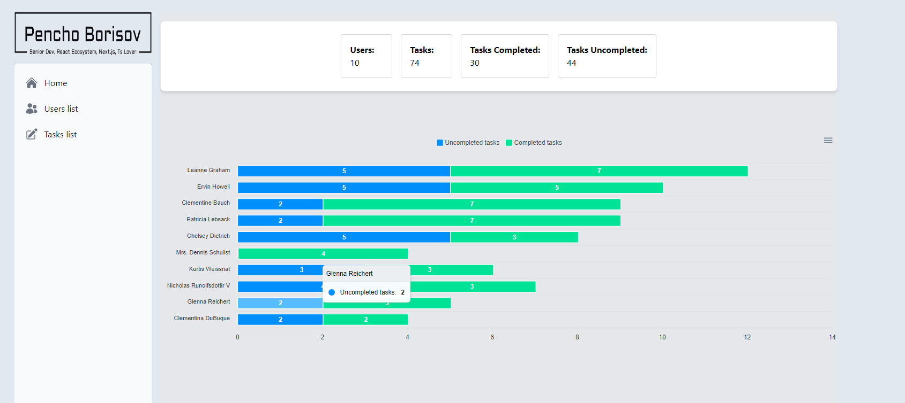
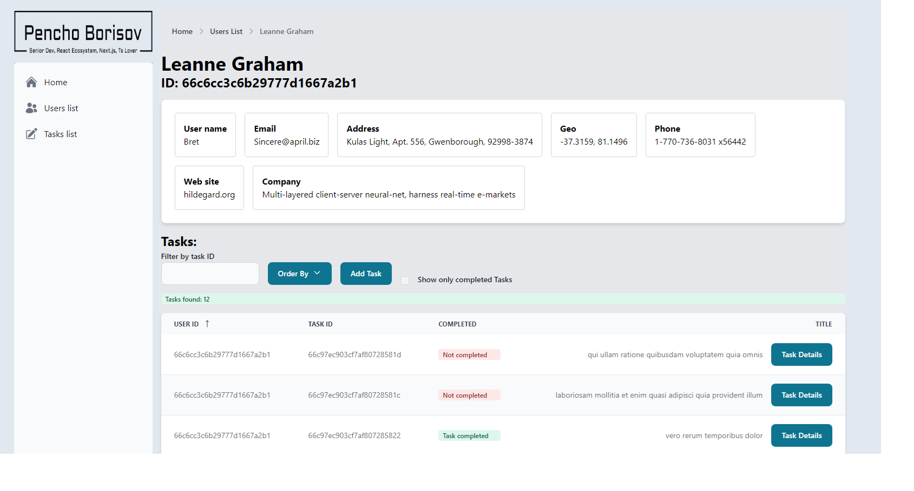

# User Management Platform

User management platform application built with Next.js and Typescript. Charts, Users, Tasks and details for them. 

### Commands
   - `pnpm i` - install dependencies
   - `pnpm dev` run app locally (`localhost:3000`)
   - `pnpm build` build app
   - `pnpm test` run tests
   - `pnpm test:watch` run current changed tests
   - `pnpm lint`  run lint
   - `pnpm lint:fix`  run fix lint
   - `pnpm prettier`  run prettier

### URL's
- http://localhost:3000
- http://localhost:3000/api/graphql
- http://localhost:3000/api/users
- http://localhost:3000/api/tasks
- http://localhost:3000/api/users/{id}
- http://localhost:3000/api/tasks/{id}

### Tech stack
- pnpm
- react-hook-form(https://react-hook-form.com)
- custom hooks
- redux-toolkit - https://redux-toolkit.js.org/
- tailwindcss - https://tailwindcss.com/docs/guides/nextjs
- flowbite-react - https://flowbite-react.com/
- icons - https://heroicons.com/
- MongoDb - https://www.mongodb.com/products/platform/cloud
- GraphQL - https://graphql.org/learn/serving-over-http/
- https://handsonreact.com/docs/react-redux-thunk
- https://tanstack.com/query/latest/docs/framework/react/overview
